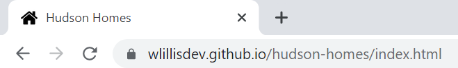

# Hudson Homes

- You can see the live website [here](https://wlillisdev.github.io/hudson-homes/index.html)..

This website is designed for Hudson Homes who is a national construction company. They have been in business for over 30 years. Although they specialise in all aspects of construction, they wanted a new website to focus primarily on the house building market and all aspects of it.

# Aim of Website

The goal of the website is to show case Hodson Homes reputation of excellence, craftmanship and experience in the house building market.
It will target a wider range of clients as previously they only focused on high end bespoke house builds. 
The site will also educate customers about the new wide range of services that Hudson Homes offers.
With the aim of converting site visitors into to potential leads & future customers.
- ### Design & Build
- ### New Builds
- ### Rennovations
- ### Extensions
Each service will be outlined in detail to educate and entice the customer to act.
The theme throughout the website is that Hudson Homes can create and build your dream home. And who doesn’t want a dream home.
And ultimately bring the customer to engage and contact Hudson Homes via the website for more information. 
The site will be targeted toward first time home owners & Family’s looking to expand and develop an existing property.

# User Stories
- First Time Visitors Aims:
  - As a first-time visitor, I want to quickly and easily understand what this website is about and what it can do for me.
  - As a first-time visitor, I want to quickly learn about the services on offer.
  - As a first-time visitor, I want to be able to easily navigate around the site to find the content I'm looking for.

- Returning Visitors Aims:
  - As a returning visitor, I would like to learn more about projects the company has built that may be similar to my project.
  - As a returning visitor, I want to learn about this company credentials & experience.
  - As a returning visitor, I would like to find links to their social media channels and follow them.

# Responsive 
The website has been designed to operate on a number of screen and devices.The following test were acrred out on [Am I Responsive](http://ami.responsivedesign.is/)
 - Homepage (displayed below)

 - Service Page [Am I Responsive Test services Page ](assets/images/readme-images/services-page-responsvie.png)

 - Contact Us Page [Am I Responsive Test contact Us Page](assets/images/readme-images/contact-page-responsive.png)

# Features 

 [View Homepage Featuers](https://wlillisdev.github.io/hudson-homes/index.html)

__Favicon__
 - As the website is based around house building i got a house icon image from [Flaticon](https://www.flaticon.com/free-icons/house)
 - This will help to further enforce the brand image of a house building company to the user.
 
 

__Navigation Bar__
 
  - The Navigation bar is located at the top of all three Pages. It is simple but clean design. It includes the logo, Home page, Service and Contact Us page.
  - It will allow a visitor to quickly and easily get around the site as each link logically leads to the next.
  - The nav elements also change colour when hovered over and also has an active line under each link when clicked which adds to the user experience.  

 

__Landing Page__

  - The landing page contains an eye-catching background image of a beautiful modern built house constructed by Hudson Homes. It immediately catches the eye and infers the aspiration of what a customer’s dream house could look like if it was built by Hudson Homes.
  - The text box further instils this with the words - you Dream it we design and build it. The customer knows instantly what Hudson Homes can do for them.
  - It also has a call to action with a button encouraging customers to get a free quote.

 

__What We Do Section__

  - What we do section allows the user to quickly evaluate if Hudson Homes has the services they require.
  - It has a simple design with minimal text about each service, but enough text to allow the user evaluate each service. Each service also has a button to encourage the user to read more about the service. When the button is clicked the user is brought directly to that section on the services page.
  - Each service has a nice icon that helps the user identify the specific service.

 

__About Us Section__

  - This is a quick and brief description about Hudson Homes. To allow the user to find out some background information about the company.
  - It outlines the  main qualities of why Hudson Homes would be an excellent partner for a new user looking to build a new home.

 

__Our Crediantials Section__

  - This is the next step on the user's journey as they scroll down the homepage, The about us section highlights why you should choose Hudson Homes as a partner but this section reinforces this point with industry credentials.
  - This section outlines the industry recognised organisations that Hudson Homes are registered members of.
  - To a new user visiting the site and having little knowledge of the company this is a big thumbs up to show them that Hudson Homes is a reputable builder.

 

__Recent Projects__
  - A short video was added to show case a recent project. It will show the users a finished house build by Hudson Homes. And the high quality and perfect finish that they can expect on their project.
  - It is placed just above the footer, where it prompts the user to follow one of the socail channels to view more projects.
  

__Footer__

  - The footer is simple and clean design it is the same on all pages of the website.
  - It contains 3 social media platforms as requested by Hudson Homes they will also open in a new window to allow easy navigation for the user.
  - The main aim of the footer is to increase engagement with visitors and get them to view new projects that are currently been built and showcase previous projects.With the goal of building confidence with new customers & getting them to subscribe to the various social channels. This is done with a simple text in the footer, Follow Our Recent Projects On. 

 

- __Hoover__

  - Each clickable element on the website changes color when hovered over with a mouse. This is to encourage users to click on buttons and links and increase engagement and user experience.
  - Buttons on the website when clicked on by the user look like they are been pushed.I added this to improved the UX of the website.

__Services Page__

  -  This page clearly lays out in more detail what construction services Hudson Homes offers. It is the next step on the users journery. 
  - Each specific service incorporated an eye catching background pictuer that is directly related to the service.
  - The same icons and similar text box style already used on the homepage is used on each service image to continue the design and flow of the site and aid in the user experience.
  - Each service has a detailed despcription of each service and what exactly Hudson Homes can offer a potential customer.
  - At the end of the text thier is a button read more, this button will encourage the user to make a furter action.On clicking this button it will lead the user to the contact us page & the contact us form. To continue the logiacal flow through the website.
  

 

  [View Services Featuers](https://wlillisdev.github.io/hudson-homes/services.html)

__Contact Us Page__

 [View Contact Us Featuers](https://wlillisdev.github.io/hudson-homes/contact-us.html)

  - The aim of the page is to convert a potential user into a lead. It has a simple but elegant contact us form layout. That captures enough information so Hudson Homes can follow up on the lead. And allows a user’s to quickly fill out the form with minimal information.
  - It also has the aspirational theme of Build your dream incorporated into it. The header image has an elegant country home, the background image is a set of keys in a new door and the form has a call to action of "start your dream home today". 
 
 

  - When the user successfully submits the contact us form, they will be brought to a thank you page. Which will also encourage the user to check out our social channels.
  

# Design
 - Theme
   - The Theme of the website is build your dream home.As a first time buyer or an existing home owner your aspiration is to build and live in a dream home you created. 
   - Fonts were imported from google fonts, Sans Pro and Open Sans were picked as they were crisp and elegant and complimented each other and the theme of the site.

 - Color Palette
   - The color palette is made up of three main colors which creates a good contrast and helps support the overall theme by creating a sleek lean and modern website.

 

- Imagery
   - The images that were selected for the website were eyecathing, elegant, OF modern designed and expertly built houses. They look like show houses and help support the theme of a user owning and designing their own dream home.

- Wireframes
   - To create the initial layout and wireframe i used Balsamiq. This helped fine tune the design and layout. It also helped in calculating the amount of content and images required.

  - [Homepage Wireframe Concept](assets/images/readme-images/wireframe-homepage.png)
  - [Servcie Page Wireframe Concept](assets/images/readme-images/service-wireframe.png)
   

# Future Development
- Burger Menu
  - I will add a burger menu for navigation for smaller screen sizes at a later date. i belive this will make the header neater and more user friendly

- Payment Portal
  - Add a payment portal to the website to allow customers pay and make stage payments online. This will improve workflow of the project and cashflow for Hudson Homes.
        

- Portfolio 
  - I would like to add a portfolio page outlining all past projects of note from Hudson Homes this will be  accompanied with a video and a Testimional from the client.

- Client Login
  - Have a login section on the site so the customer can look at changes to drawings, approve changes, make changes, get live updates on the project from the project manager and to upload tender documents.

# Testing

### Validator Testing 

 - HTML Validator
   - [W3C](https://validator.w3.org/) site was used to validate the **HTML** code.
   - A number of small errors were initially flagged up. Some duplicate tags were removed and I also had to rename a number of images. I also misplaced a link tag in the homepage, as I copied this page structure for the rest of the site i had to fix it on all of these pages also
     - [Erros From Validator Hompage](assets/images/readme-images/error_homepge.png)
     - [Erros From Validator Hompage](assets/images/readme-images/error-homepage-2.png)
     - [Erros From Validator Contact Us](assets/images/readme-images/contact-us-error.png)

   

 ### All Pages are now error free see links below:

 
   - [Homepage](https://validator.w3.org/nu/?doc=https%3A%2F%2Fwlillisdev.github.io%2Fhudson-homes%2Findex.html)
   - [Services Page](https://validator.w3.org/nu/?doc=https%3A%2F%2Fwlillisdev.github.io%2Fhudson-homes%2Fservices.html)
   - [Contact Us Page](https://validator.w3.org/nu/?doc=https%3A%2F%2Fwlillisdev.github.io%2Fhudson-homes%2Fcontact-us.html)
   - [Thank You Page](https://validator.w3.org/nu/?doc=https%3A%2F%2Fwlillisdev.github.io%2Fhudson-homes%2Fthank-you.html%3Ffirst_name%3Drvvr%26last_name%3Drvrv%26email_address%3Drvrv%2540gmail.com%26service_preference%3Dnew-builds)

## CSS Validator
  - The [W3C](https://validator.w3.org/) was used to validate the **CSS** code
  - The website passed with no errors

  

  ### See links below for Results:

   - [CSS Test Results](https://jigsaw.w3.org/css-validator/validator?uri=https%3A%2F%2Fwlillisdev.github.io%2Fhudson-homes%2Findex.html&profile=css3svg&usermedium=all&warning=1&vextwarning=&lang=en)

 
## Lighthouse
 - Lighthouse testing was carried out in Developer Tools in Chrome. Initially it gave a number of improvements and flagged up a number of images that needed to be reduced in size. Which was done.

 - The results were also skewed as the chrome extensions on my testing device was affecting the lighthouse results. The tests of all pages were redone in a incognito window and performance score increased.

 
 - [Service Page lighthouse results](assets/images/readme-images/light-house-service.png)
 - [Contact Us lighthoust results](assets/images/readme-images/light-house-contact.png)

## Manual Testing
  - All the site links were manually tested to see if they all worked ok and linked to the correct locations.
  - The form was checked that name and email were required, that the radio buttons functioned and that the submit button worked.
  - The site was further tested using feedback from mentor,family and friends who checked it on diffrent devices they had.
  - All of the page's features were tested on Google Chrome, Microsoft Edge, Mozilla Firefox, Safari, and Opera .
  - Google Chrome's Developer Tool was used to inspect page elements during the build and helped indentify and debug issues within the HTML and CSS.
  - The README.md was checked before final submission and links verfied.

# Bugs

  - After running the site through HTML checker, a number of small bugs were identified. Each error was identified and an appropriate solution applied, i went through all pages and fixed any errors. It was good lesson and practice in finding problems with code and fixing them.
  - After Running all the pages through lighthouse, it identified issues with a number of images due to size. Lighthouse suggested to change some larger images which was done.
  - The what we do section on the home page i was having trouble in getting it to be responsvie, i decieded to implement css grid which worked out well and fixed the problem
  - On low quailty smart phones with with pixle width less than 300px the hompe page hero text banner did not look great, so i decided to add a media query and remove it  as i felt it was affecting user experience.

  # Unfixed Bugs
  - Apart from removeing the hero banner text from the hompage for smart phones with screen sizes below 300px i am unaware of any other bugs at this time.

# Deployment

The site was created using Visual Studio Code and GitHub, and deployed to GitHub pages for testing using the below process:

 - Clicked on my respository for [wlillisdev/hudson-homes](https://github.com/wlillisdev/hudson-homes).
 - Clicked settings tab and navigated down to "pages"
 - Selected "Main" in branch drop down box.
 - Clicked "save" which produced the live link which can be viewed [here](https://wlillisdev.github.io/hudson-homes/index.html).. 

 ## Version Control
  - Git was used as the version control software. Commands such as git add ., git status, git commit and git push were used to add, save, stage and push the code to the GitHub repository.

## Cloning

1. On [GitHub](www.github.com), navigate to the main page of the repository.  [Click Here for Reposititory Link](https://github.com/wlillisdev/hudson-homes)

2. Above the list of files, click Code.

3. click Use GitHub CLI, then click the copy icon.

4. Open Git Bash and change the current working directory to the location where you want the cloned directory.

5. Type git clone, and then paste the URL that was copied previouly in step 3.

6. Press Enter to create the local clone.

[git cloning steps with pictuers](https://docs.github.com/en/repositories/creating-and-managing-repositories/cloning-a-repository#cloning-a-repository-to-github-desktop)

# Credits

- ## Languages

  - [HTML5](https://en.wikipedia.org/wiki/HTML5)
  - [CSS](https://en.wikipedia.org/wiki/CSS)

- ## Content
   - The code for the contact us form was taken from the love running tutorial from [Code Institute](https://codeinstitute.net/ie/) and modified.
   - The header layout was inspired from the love running tutorial from [Code Institute](https://codeinstitute.net/ie/).
   - The icons used throughout the site were from [Font Awesome](https://fontawesome.com/)
   - Variour Youtube tutorial were used to help understand felexbox and css grid.
    - [Flexbox](https://www.youtube.com/watch?v=fYq5PXgSsbE)
    - [css Grid](https://www.youtube.com/watch?v=moBhzSC455o)

-  ## Images
   - All images were taken from [Pexels](https://en.wikipedia.org/wiki/CSS)

  
 -  ## Resources
    - [Stack Overflow](https://stackoverflow.com/)
    - [W3Schools](https://www.w3schools.com/)
    - [w3docs](https://www.w3docs.com/)
    - Notes & Videos from course work from [Code Institute](https://codeinstitute.net/ie/)

-  ## Tools
   - [Balsamiq](https://balsamiq.com/) - Used to create wireframes
   - [Google Fonts](https://fonts.google.com/) - Used to import fonts
   - [TinyPNG](https://tinypng.com/) - Used to compress images

-  ## Acknowledgements
   - Special thanks to my mentor [Chris Quinn](https://github.com/10xOXR) for his help and guidance in the development of my first website. Special thanks to my tutor Kasia and our regular class meeting’s and members of the awesome slack community

   # Conclusion
    - I would put more emphasis on a mobile first design when it came to building out the site.
    - If I was to build this site again, I would spend more time on the wireframes and know exactly how to structure each section and element before i start.
    - Due to time constraints, I did not have time to experiment a lot with flex or CSS grid, I think I could have got a better services page layout with CSS grid.
    - I would also learn to make more commits during the project built.

   

